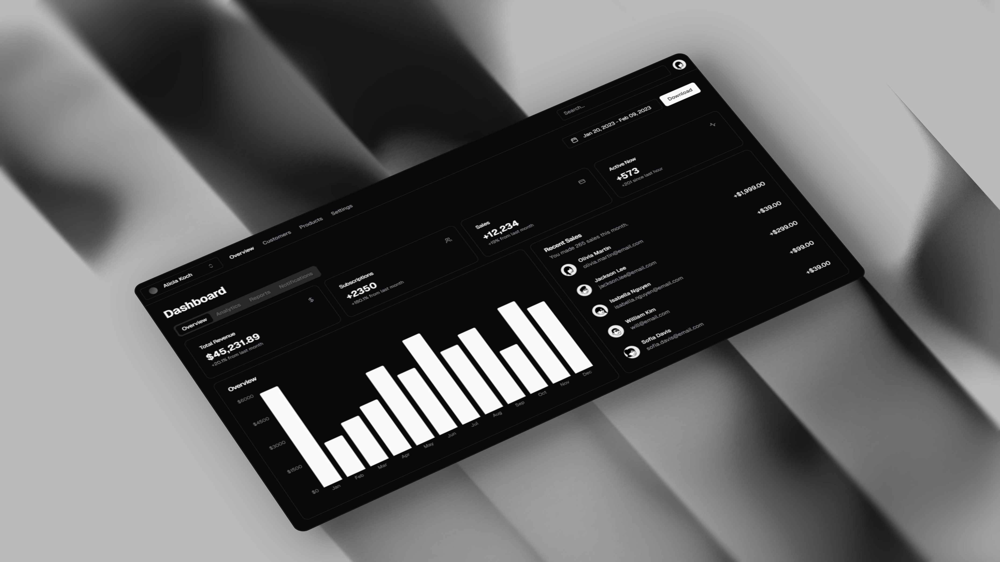

<p align="center">
	<h1 align="center"><b>Ducen ERP</b></h1>
<p align="center">
    Streamline and automate your business processes
    <br />
    <br />
    <a href="https://discord.gg/ducen-erp">Discord</a>
    ·
    <a href="https://ducen-erp.com">Website</a>
    ·
    <a href="https://github.com/yourusername/ducen-erp/issues">Issues</a>
  </p>
</p>

## About Ducen ERP

Ducen ERP is an enterprise resource planning system designed to streamline and automate various business processes. Built with Next.js, it leverages modern web technologies to provide a fast, responsive, and user-friendly interface.

## Features

**Modular Architecture**: Easily extendable and maintainable codebase.<br/>
**Responsive Design**: Optimized for mobile and desktop devices using Tailwind CSS.<br/>
**Server-Side Rendering**: Improved performance and SEO with Next.js SSR.<br/>
**State Management**: Efficient state management using React Context and hooks.<br/>
**UI Components**: Built with Shadcn UI and Radix UI for a consistent look and feel.<br/>

## App Architecture

- Monorepo
- React
- TypeScript
- Next.js
- Supabase
- Shadcn UI
- TailwindCSS
- BetterAuth

### Hosting

- Supabase (database, storage, realtime)
- Vercel (Website, edge-config, and metrics)
- Upstash (redis)

### Services

- Trigger.dev (background jobs)
- Resend (Transactional & Marketing)
- Github Actions (CI/CD)
- Polar (Payment processing)

## Getting Started

1. First, clone the repository:

```bash
git clone https://github.com/duccem/erp.git
cd erp
```

2. Install the dependencies:

```bash
npm install
```

3. Create a `.env.local` file in the root directory and add the following environment variables:

```env
# .env.local
NODE_ENV=development
PORT= 3000
NEXT_PUBLIC_API_URL=http://localhost:3000/api
DATABASE_URL=your_database_url
DIRECT_URL=your_direct_url
BETTER_AUTH_SECRET="0c8f3e6033e063298e639da8"
BETTER_AUTH_URL=http://localhost:3000
GOOGLE_CLIENT_SECRET=your_google_client_secret
GOOGLE_CLIENT_ID=your_google_client_id
SUPABASE_ACCESS_TOKEN=your_supabase_access_token
NEXT_PUBLIC_SUPABASE_URL=your_supabase_url
NEXT_PUBLIC_SUPABASE_KEY=your_supabase_key
NEXT_PUBLIC_BASE_URL=http://localhost:3000

# Add other environment variables as needed
```

4. Run the schema sychronization:

```bash
npm run prisma generate
npm run prisma db push
```

5. Run the development server:

```bash
npm run dev
```

6. Open [http://localhost:3000](http://localhost:3000) with your browser to see the result.

You can start editing the page by modifying `app/page.tsx`. The page auto-updates as you edit the file.

## License

This project is licensed under the **[AGPL-3.0](https://opensource.org/licenses/AGPL-3.0)** for non-commercial use.

### Commercial Use

For commercial use or deployments requiring a setup fee, please contact us
for a commercial license at [ducen29@gmail.com](mailto:ducen29@gmail.com).

By using this software, you agree to the terms of the license.
