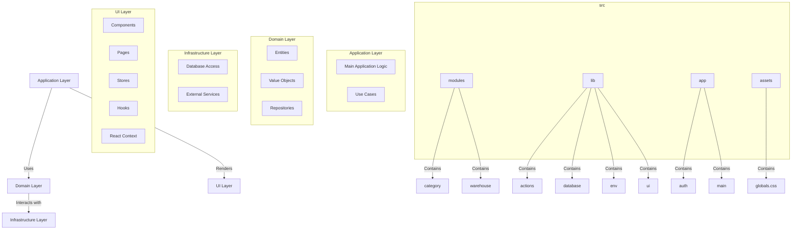

# Architecture Diagram

## Resumen

La arquitectura del proyecto se divide en cuatro capas principales:

1. **Application Layer**: Contiene la lógica principal de la aplicación y los casos de uso.
2. **Domain Layer**: Define las entidades, objetos de valor y repositorios.
3. **Infrastructure Layer**: Maneja el acceso a la base de datos y servicios externos.
4. **UI Layer**: Incluye los componentes de la interfaz de usuario, páginas, tiendas, hooks y contextos de React.

Cada capa interactúa con las otras de manera específica para mantener una separación clara de responsabilidades y facilitar el mantenimiento y la escalabilidad del proyecto.



## Estructura de carpetas

```
src/
├── lib/
│   ├── actions/
│   ├── database/
│   ├── env/
│   └── ui/
└── modules/
    ├── category/
    │   ├── application/
    │   ├── domain/
    │   ├── infrastructure/
    │   └── ui/
    └── warehouse/
        ├── application/
        ├── domain/
        ├── infrastructure/
        └── ui/
```
