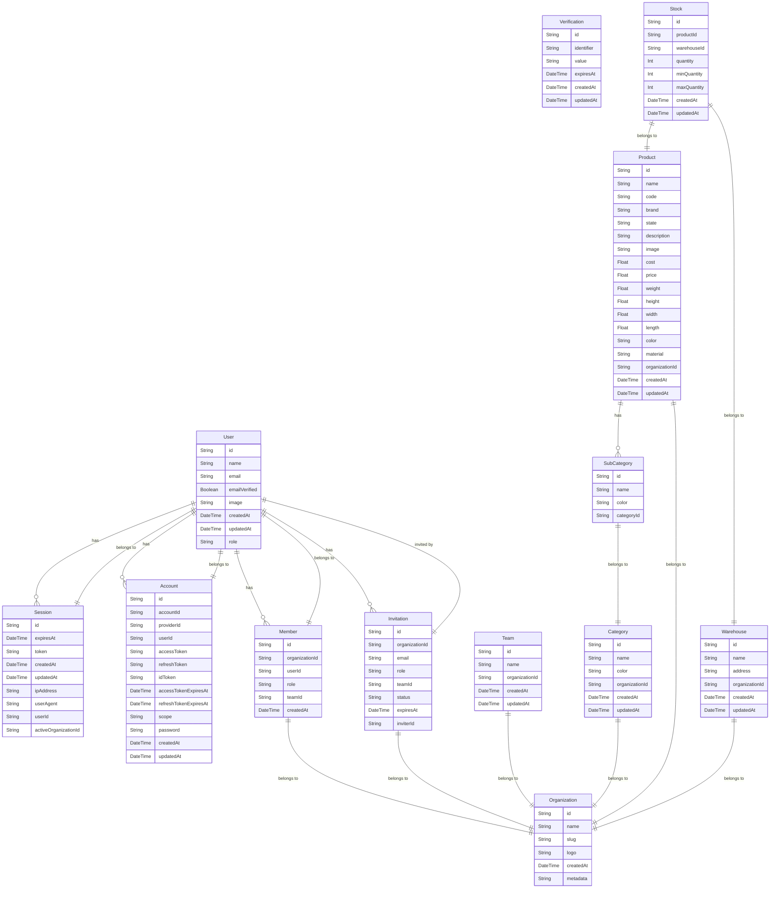

# Database Schema

```mermaid
erDiagram
    User {
        String id
        String name
        String email
        Boolean emailVerified
        String image
        DateTime createdAt
        DateTime updatedAt
        String role
    }
    Session {
        String id
        DateTime expiresAt
        String token
        DateTime createdAt
        DateTime updatedAt
        String ipAddress
        String userAgent
        String userId
        String activeOrganizationId
    }
    Account {
        String id
        String accountId
        String providerId
        String userId
        String accessToken
        String refreshToken
        String idToken
        DateTime accessTokenExpiresAt
        DateTime refreshTokenExpiresAt
        String scope
        String password
        DateTime createdAt
        DateTime updatedAt
    }
    Verification {
        String id
        String identifier
        String value
        DateTime expiresAt
        DateTime createdAt
        DateTime updatedAt
    }
    Organization {
        String id
        String name
        String slug
        String logo
        DateTime createdAt
        String metadata
    }
    Member {
        String id
        String organizationId
        String userId
        String role
        String teamId
        DateTime createdAt
    }
    Invitation {
        String id
        String organizationId
        String email
        String role
        String teamId
        String status
        DateTime expiresAt
        String inviterId
    }
    Team {
        String id
        String name
        String organizationId
        DateTime createdAt
        DateTime updatedAt
    }
    Category {
        String id
        String name
        String color
        String organizationId
        DateTime createdAt
        DateTime updatedAt
    }
    SubCategory {
        String id
        String name
        String color
        String categoryId
    }
    Product {
        String id
        String name
        String code
        String brand
        String state
        String description
        String image
        Float cost
        Float price
        Float weight
        Float height
        Float width
        Float length
        String color
        String material
        String organizationId
        DateTime createdAt
        DateTime updatedAt
    }
    Stock {
        String id
        String productId
        String warehouseId
        Int quantity
        Int minQuantity
        Int maxQuantity
        DateTime createdAt
        DateTime updatedAt
    }
    Warehouse {
        String id
        String name
        String address
        String organizationId
        DateTime createdAt
        DateTime updatedAt
    }

    User ||--o{ Session : "has"
    User ||--o{ Account : "has"
    User ||--o{ Member : "has"
    User ||--o{ Invitation : "has"
    Session ||--|| User : "belongs to"
    Account ||--|| User : "belongs to"
    Member ||--|| User : "belongs to"
    Member ||--|| Organization : "belongs to"
    Invitation ||--|| User : "invited by"
    Invitation ||--|| Organization : "belongs to"
    Team ||--|| Organization : "belongs to"
    Category ||--|| Organization : "belongs to"
    SubCategory ||--|| Category : "belongs to"
    Product ||--|| Organization : "belongs to"
    Product ||--o{ SubCategory : "has"
    Stock ||--|| Product : "belongs to"
    Stock ||--|| Warehouse : "belongs to"
    Warehouse ||--|| Organization : "belongs to"
```
